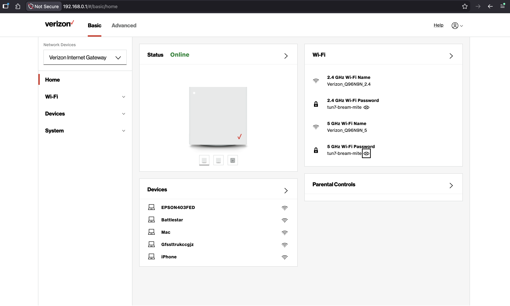
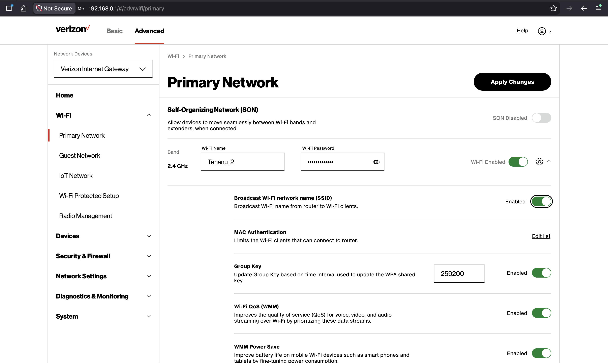
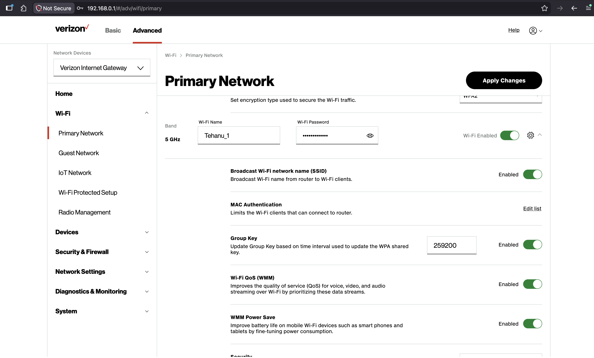
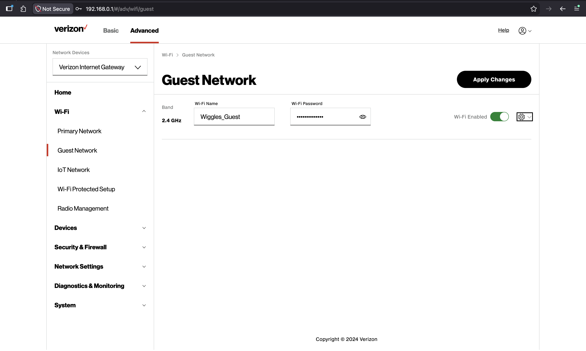
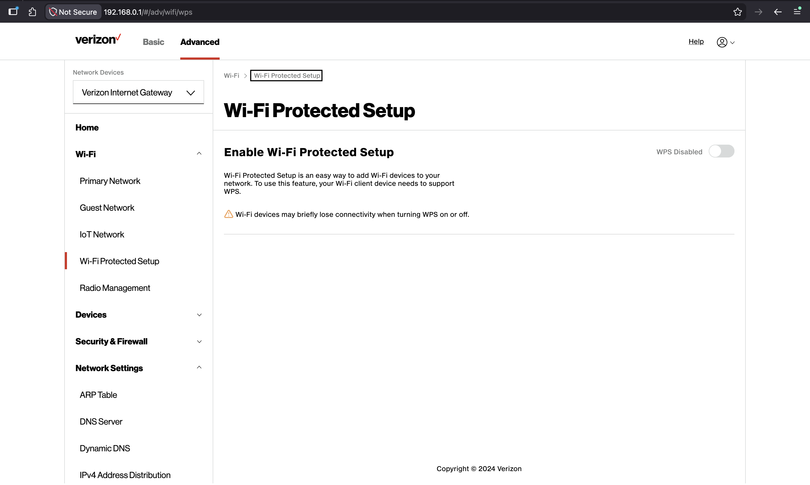
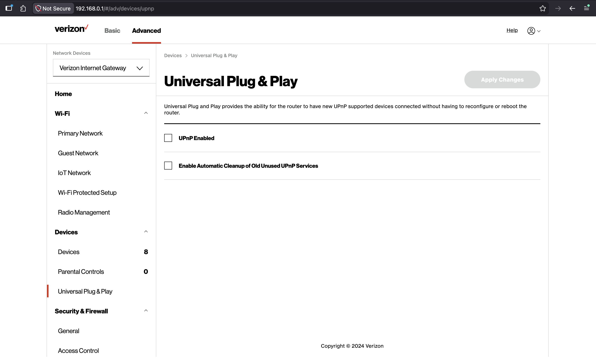

## Home WiFi Hardening Process

Hardening home WiFi routers can help keep your small office/home office secure and keep your faily network from outside intrusion. The router used in this scenario is a Verizon 5G Home Internet Gateway. This router acts as a wireless router, switch, and access point. While home routers may vary, the steps used in this exercise are standard changes used to secure a hom network. Please consult your device's manual for specific instructions on hardening your home network.

1. Default passwords
    - Changed default passwords (Advanced > Primary Network > 2.5 GHz > Password > 5.0 GHz > Wi-fi Password)
    
    
2. Default SSID 
    - Changed default SSID (Advanced > Primary Network > 2.5 GHz > Wi-Fi Name > 5.0 GHz > Wi-fi Name)
    - Decided to keep SSID broadcast according to this article https://support.apple.com/en-us/102766. 
    - Disabling SSID will cause devices to constantly broadcast probe requests when away from home network, potentially exposing devices to malicious actors.
    - Kept WiFi settings at WPA2 (AES) so non-WPA3 enabled devices can still connect 
    
    

3. Guest network
    - Created guest network segregated from main network (Advanced > Wi-fi > Guest Network > Wifi enabled)
    - Changed default password
    - IoT devices will go on Guest channel
    

4. WiFi Protected Setup
    - Disabled WPS (Advanced > Wi-Fi > Wi-Fi Protected Setup > WPS Disabled)
    - Unsecure due to PIN code needed to connect.
    

5. Disable UPnP
    - Disabled Universal Plug and Play (Advanced > Devices > Universal Plug & Play)
    - UPnP unsecure due to ability to quickly connect to network and considered authorized for network
    

